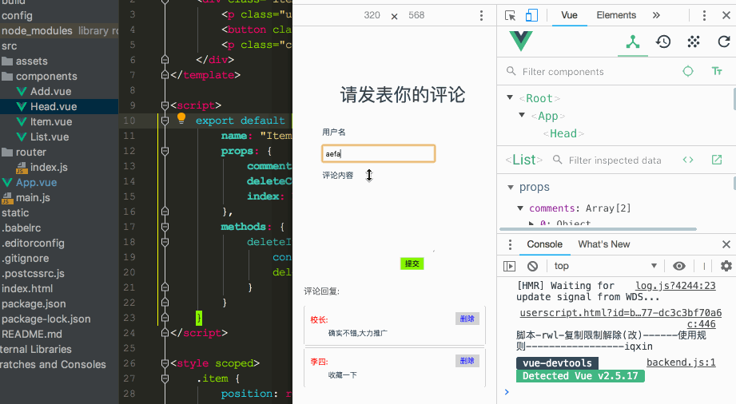

# vuehtmldemo

> created by zhouyu
> Email: 1512450002@qq.com

## 目录

1. 001-数据绑定v-model
2. 002-模板语法
3. 003-计算属性和监视
4. 004-绑定class和style
5. 005-条件渲染指令
6. 006-列表渲染
7. 007-列表的排序和过滤
8. 008-事件绑定处理
9. 009-表单绑定处理
10. 010-Vue实例生命周期
11. 011-vue动画
12. 012-过滤器
13. 013-vue指令与自定义指令
14. 014-插件和开发
15. 015-SimpleDemo
 
 ## 简单demo
 
 
